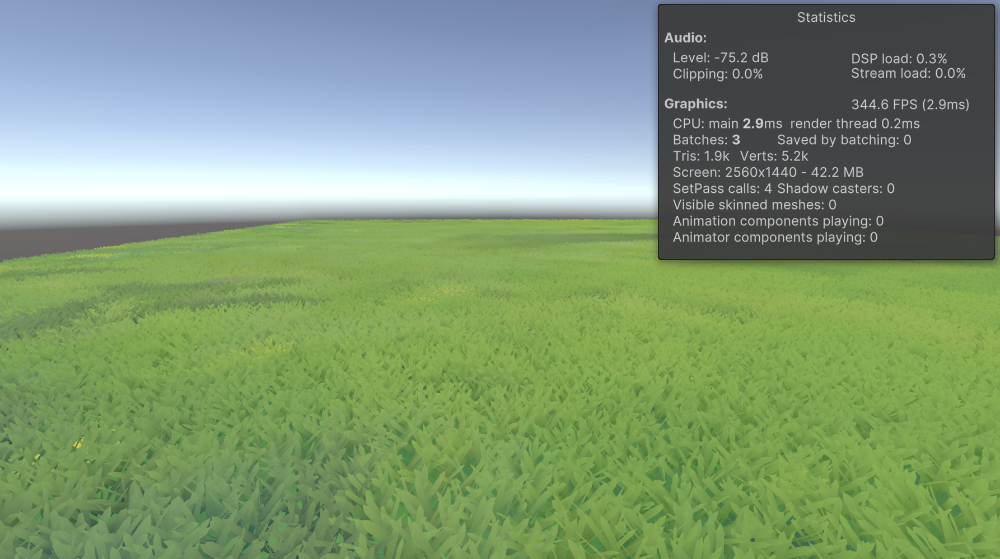

# 🌿 Procedural GPU Grass Rendering in Unity (Built-in RP + Compute Shader)

## Overview

This project implements a **high-performance grass rendering system** in Unity using:

* `ComputeShader` for procedural grass instance generation
* `DrawMeshInstancedIndirect` for efficient GPU instancing
* Fully compatible with **macOS + Metal**, **Unity Built-in RP**

## Demo Features

| Feature                                   | Description                                                                          |
| ----------------------------------------- | ------------------------------------------------------------------------------------ |
| ✅ **Procedural Placement**                | Grass blades are distributed across a plane with spatial jitter for natural density. |
| ✅ **Per-blade Growth Direction**          | Each blade is given a random growth direction vector for dynamic bending.            |
| ✅ **Random Rotation Angle**               | Grass blades are randomly rotated (around Y) for visual variety.                     |
| ✅ **Vertex Wind Animation**               | Wind is simulated in vertex shader using height-based sway with spring damping.      |
| ✅ **Ground Color Modulation**             | Grass color is blended with a terrain texture for local variation.                   |
| ✅ **Dynamic Wind Phase**                  | Wind offset varies by position, creating traveling wave-like motion.                 |
| ✅ **Nonlinear Sway**                      | Higher parts of grass bend more than roots (`pow(height, 1.5)` based sway).          |

---

## 📂 Project Core Structure

```
Assets/
├── Shaders/
│   ├── GrassInstanced.shader         # HLSL shader with wind + gradient + terrain color blending
│   └── GrassCompute.compute          # ComputeShader for grass placement, angle, direction
├── Scripts/
│   └── GrassRenderer.cs              # Main controller for dispatching and rendering
├── Textures/
│   └── GroundTex.png                 # Terrain base color for blending
```

---

## Key Technologies

* `ComputeShader` to generate:

  * `positionBuffer`: xyz + rotation angle
  * `growDirBuffer`: growth direction vector
* `DrawMeshInstancedIndirect`: GPU-side grass rendering
* Custom grass blade mesh generated at runtime (`BuildDiamondGrassBlade`)
* Per-blade sway simulation with spring damping and wind strength

---

### Grass Logic Summary

* Each grass blade is:

  * Planted at jittered grid location
  * Assigned a random rotation (around Y)
  * Tilted slightly in a random upward direction
  * Bent dynamically via a wind function + spring model
  * Colored by height gradient + terrain texture sample

---

## Visual Result



---

### 🔮 Possible Extensions

* ✅ Distance-based LOD (already prepared)
* 🌬️ Wind texture distortion (already partially implemented)
* 🌱 Interaction (e.g. characters flatten grass)
* ⛅ Light & shadow support
* 🌾 Varying grass species / color clusters

---

### 💡 Credits & Inspiration

* Inspired by Studio Ghibli-style grass motion 🌱
* Uses math-heavy random hashing for fast procedural placement

---

### 📋 Requirements

* Unity 6+ (Built-in Render Pipeline)
* macOS or Windows
* No URP/HDRP dependencies
